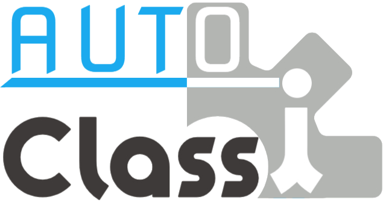

  



## 注意
**事前にnode.jsをインストールする必要があります。ご注意ください。**  
**Chromeを複数開いていると上手く作動しない場合があります。Chromeをすべて閉じたうえでもう一度試してください。**

## 使い方
1. コンソール（PowerShell等）を開き、下記のコマンドを入力し実行します。  
```bash
npm install -g auto-classi
```
2. 下記のコマンドを入力して実行します。これによりChromeが開かれます。
```bash
autoclassi open
```
3. 開かれたChromeで、Classiにログインし先生課題の欄を開きます。取り組み中の欄を開いておいてください。
4. 下記のコマンドで自動操作が始まります。
```bash
autoclassi run
```

## コマンドについて

